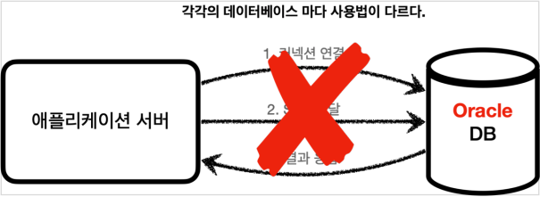

# JDBC 이해

## 프로젝트 생성

### Spring initializer

* https://start.spring.io/
* 프로젝트 선택
    * Project: Gradle - Groovy
    * Language: Java 17
    * Spring Boot: 3.0.2
* Project Metadata
    * Group: hello
    * Artifact: spring-db-1
    * Packaging: Jar
* Dependencies
    * JDBC API, H2 Database, Lombok

### build.gradle

```gradle
dependencies {
    // ...
    // 테스트에서 Lombok 사용
    testCompileOnly 'org.projectlombok:lombok'
    testAnnotationProcessor 'org.projectlombok:lombok'
}
```

테스트에서 Lombok을 사용하기 위해 두 줄을 추가한다.

## H2 데이터베이스 설정

### 설치

* https://www.h2database.com/html/download-archive.html
    * 현재 자신의 스프링 부트의 버전에 맞는 버전을 설치하자.
    * Spring Boot 3.0.2의 경우, **h2 2.1.214** 버전이다.
* 설치한 폴더의 bin 폴더에 들어가서 아래의 명령어를 입력한다.
    * 권한 설정: `chmod 755 h2.sh`
    * 실행: `./h2.sh`
* 브라우저가 실행되면 URL에 IP 부분을 `localhost`로 변경한다.
* JDBC URL에 `jdbc:h2:~/test`를 입력한다. (최초 한번)
    * `~` 경로에 `~/test.mv.db` 파일이 생성되었는지 확인한다.
* 이후 부터는 JDBC URL에 `jdbc:h2:tcp://localhost/~/test`를 입력하여 접속한다.

### 테이블 생성

```roomsql
drop table member if exists cascade;
create table member (
    member_id varchar(10),
    money integer not null default 0,
    primary key (member_id)
);

insert into member(member_id, money) values ('hi1',10000);
insert into member(member_id, money) values ('hi2',20000);
```

### 테이블 확인

```roomsql
select * from member;
```

## JDBC 이해

### JDBC 등장 이유

애플리케이션을 개발할 때 중요한 데이터는 대부분 데이터베이스에 보관한다.

#### 클라이언트, 애플리케이션 서버, DB


클라이언트가 애플리케이션 서버를 통해 데이터를 저장하거나 조회하면, 애플리케이션 서버는 다음 과정을 통해서 데이터베이스를 사용한다.

#### 애플리케이션 서버와 DB - 일반적인 사용법


1. 커넥션 연결: 주로 TCP/IP를 사용해서 커넥션을 연결한다.
2. SQL 전달: 애플리케이션 서버는 DB가 이해할 수 있는 SQL을 연결된 커넥션을 통해 DB에 전달한다.
3. 결과 응답: DB는 전달된 SQL을 수행하고 그 결과를 응답한다. 애플리케이션 서버는 응답 결과를 활용한다.

#### 애플리케이션 서버와 DB - DB 변경



문제는 각각의 데이터베이스마다 커넥션을 연결하는 방법, SQL을 전달하는 방법, 그리고 결과를 응답 받는 방법이 모두 다르다는 점이다.

참고로 관계형 데이터베이스는 수십개가 있다. 여기에는 2가지 큰 문제가 있다.

1. 데이터베이스를 다른 종류의 데이터베이스로 변경하면 애플리케이션 서버에 개발된 데이터베이스 사용 코드도 함께 변경해야 한다.
2. 개발자가 각각의 데이터베이스마다 커넥션 연결, SQL 전달, 그리고 그 결과를 응답 받는 방법을 새로 학습해야 한다.

이런 문제를 해결하기 위해 JDBC라는 자바 표준이 등장한다.

### JDBC 표준 인터페이스

> JDBC(Java Database Connectivity)는 자바에서 데이터베이스에 접속할 수 있도록 하는 자바 API다. <br>
> JDBC는 데이터베이스에서 자료를 쿼리하거나 업데이트하는 방법을 제공한다. - 위키백과

#### JDBC 표준 인터페이스


대표적으로 다음 3가지 기능을 표준 **인터페이스**로 정의해서 제공한다.

* `java.sql.Connection` - 연결
* `java.sql.Statement` - SQL을 담은 내용
* `java.sql.ResultSet` - SQL 요청 응답

자바는 이렇게 표준 인터페이스를 정의해두었다.
이제부터 개발자는 이 표준 인터페이스만 사용해서 개발하면 된다.

그런데 인터페이스만 있다고해서 기능이 동작하지는 않는다.
이 JDBC 인터페이스를 각각의 DB 벤더(회사)에서 자신의 DB에 맞도록 구현해서 라이브러리로 제공하는데, 이것을 JDBC 드라이버라 한다.
예를 들어서 MySQL DB에 접근할 수 있는 것은 MySQL JDBC 드라이버라 하고, Oracle DB에 접근할 수 있는 것은 Oracle JDBC 드라이버라 한다.

#### MySQL 드라이버 사용


#### Oracle 드라이버 사용


### 정리

JDBC의 등장으로 다음 2가지 문제가 해결되었다.

1. 데이터베이스를 다른 종류의 데이터베이스로 변경하면 애플리케이션 서버의 데이터베이스 사용 코드도 함께 변경해야하는 문제
    * 애플리케이션 로직은 이제 JDBC 표준 인터페이스에만 의존한다.
    * 따라서 데이터베이스를 다른 종류의 데이터베이스로 변경하고 싶으면 JDBC 구현 라이브러리만 변경하면 된다.
    * 따라서 다른 종류의 데이터베이스로 변경해도 애플리케이션 서버의 사용 코드를 그대로 유지할 수 있다.
2. 개발자가 각각의 데이터베이스마다 커넥션 연결, SQL 전달, 그리고 그 결과를 응답 받는 방법을 새로 학습해야하는 문제
    * 개발자는 JDBC 표준 인터페이스 사용법만 학습하면 된다.
    * 한번 배워두면 수십개의 데이터베이스에 모두 동일하게 적용할 수 있다.

### 참고 - 표준화의 한계

* JDBC의 등장으로 많은 것이 편리해졌지만, 각각의 데이터베이스마다 SQL, 데이터타입 등의 일부 사용법 다르다.
    * ANSI SQL이라는 표준이 있기는 하지만 일반적인 부분만 공통화했기 때문에 한계가 있다.
    * 대표적으로 실무에서 기본으로 사용하는 **페이징 SQL**은 각각의 데이터베이스마다 사용법이 다르다.
* 결국 데이터베이스를 변경하면 JDBC 코드는 변경하지 않아도 되지만, **SQL은 해당 데이터베이스에 맞도록 변경**해야한다.
* 참고로 **JPA**(Java Persistence API)를 사용하면 이렇게 각각의 데이터베이스마다 다른 SQL을 정의해야 하는 문제도 많은 부분 해결할 수 있다.

## JDBC와 최신 데이터 접근 기술

## 데이터베이스 연결

## JDBC 개발 - 등록

## JDBC 개발 - 조회

## JDBC 개발 - 수정, 삭제
