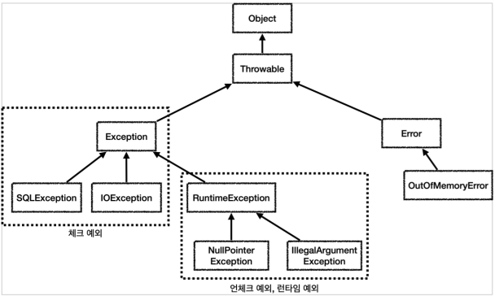
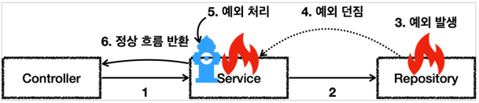
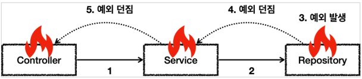

# 자바 예외 이해

## 예외 계층

### 예외 계층

스프링이 제공하는 예외 추상화를 이해하기 위해서는 먼저 자바 기본 예외에 대한 이해가 필요하다.
예외는 자바 언어의 기본 문법에 들어가기 때문에 대부분 아는 내용일 것이다.
예외의 기본 내용을 간단히 복습하고, 실무에 필요한 **체크 예외와 언체크 예외의 차이와 활용 방안**에 대해서도 알아보자.

#### 예외 계층 그림



* `Object`
    * 예외도 객체이다. 모든 객체의 최상위 부모는 Object 이므로 예외의 최상위 부모도 Object 이다.
* `Throwable`
    * 최상위 예외이다. 하위에 `Exception`과 `Error`가 있다.
* `Error`
    * 메모리 부족이나 심각한 시스템 오류와 같이 애플리케이션에서 복구 불가능한 시스템 예외이다.
    * 애플리케이션 개발자는 이 예외를 잡으려고 해서는 안된다.
    * 상위 예외를 `catch`로 잡으면 그 하위 예외까지 함께 잡는다.
    * 따라서 애플리케이션 로직에서는 `Throwable`예외도 잡으면 안되는데, 앞서 이야기한 `Error`예외도 함께 잡을 수 있기 때문이다.
    * 애플리케이션 로직은 이런 이유로 `Exception`부터 필요한 예외로 생각하고 잡으면 된다.
    * 참고로 `Error`도 언체크 예외이다.
* `Exception`
    * 체크 예외
    * 애플리케이션 로직에서 사용할 수 있는 실질적인 최상위 예외이다.
    * Exception 과 그 하위 예외는 모두 컴파일러가 체크하는 체크 예외이다.
    * 단 `RuntimeException`은 예외로 한다.
* `RuntimeException`
    * 언체크 예외, 런타임 예외
    * 컴파일러가 체크 하지 않는 언체크 예외이다.
    * `RuntimeException`과 그 자식 예외는 모두 언체크 예외이다.
    * `RuntimeException`의 이름을 따라서 `RuntimeException`과 그 하위 언체크 예외를 런타임 예외라고 많이 부른다.
    * 여기서도 앞으로는 런타임 예외로 종종 부르겠다

## 예외 기본 규칙

예외는 폭탄 돌리기와 같다. 잡아서 처리하거나, 처리할 수 없으면 밖으로 던져야한다.

### 예외 처리 - catch



5번에서 예외를 처리하면 이후에는 애플리케이션 로직이 정상 흐름으로 동작한다.

### 예외 던짐 - throw



예외를 처리하지 못하면 호출한 곳으로 예외를 계속 던지게 된다.

### 예외에 대해서는 2가지 기본 규칙을 기억하자.

1. 예외는 잡아서 처리하거나 던져야 한다.
2. 예외를 잡거나 던질 때 지정한 예외뿐만 아니라 그 예외의 자식들도 함께 처리된다.
   예를 들어서 `Exception`을 `catch`로 잡으면 그 하위 예외들도 모두 잡을 수 있다.
   예를 들어서 `Exception`을 `throws`로 던지면 그 하위 예외들도 모두 던질 수 있다.

### 참고: 예외를 처리하지 못하고 계속 던지면 어떻게 될까?

자바 `main()`쓰레드의 경우 예외 로그를 출력하면서 **시스템이 종료**된다.

웹 애플리케이션의 경우 여러 사용자의 요청을 처리하기 때문에 하나의 예외 때문에 시스템이 종료되면 안된다.
WAS가 해당 예외를 받아서 처리하는데, 주로 사용자에게 개발자가 지정한, 오류 페이지를 보여준다.

## 체크 예외 기본 이해

* `Exception`과 그 하위 예외는 모두 컴파일러가 체크하는 체크 예외이다. 단 `RuntimeException`은 예외로 한다.
* 체크 예외는 잡아서 처리하거나, 또는 밖으로 던지도록 선언해야한다. 그렇지 않으면 **컴파일 오류**가 발생한다.

### 체크 예외 전체 코드

```java
@Slf4j
public class CheckedTest {

    @Test
    void checked_catch() {
        Service service = new Service();
        Assertions.assertThat(service.callCatch()).isEqualTo("ex");
    }

    @Test
    void checked_throw() {
        Service service = new Service();
        Assertions.assertThatThrownBy(service::callThrow).isInstanceOf(MyCheckedException.class);
    }

    /**
     * Exception 상속 - CheckedException
     */
    static class MyCheckedException extends Exception {
        public MyCheckedException(String message) {
            super(message);
        }
    }

    /**
     * 가상 Service
     * 예외를 잡아서 처리하거나, 밖으로 던져야 한다.
     */
    static class Service {
        static final Repository repository = new Repository();

        /**
         * 예외를 잡아서 처리
         */
        public String callCatch() {
            String errorMessage = null;
            try {
                repository.call();
            } catch (MyCheckedException e) {
                log.info("예외 처리, message = {}", e.getMessage(), e);
                errorMessage = e.getMessage();
            }
            return errorMessage;
        }

        /**
         * 체크 예외를 처리하지 않고 밖으로 던짐
         */
        public void callThrow() throws MyCheckedException {
            repository.call();
        }

    }

    /**
     * 가상 Repository
     * - MyCheckedException 을 던진다
     */
    static class Repository {
        public void call() throws MyCheckedException {
            throw new MyCheckedException("ex");
        }
    }
}
```

#### Exception을 상속받은 예외는 체크 예외가 된다.

```java
static class MyCheckedException extends Exception {
    public MyCheckedException(String message) {
        super(message);
    }
}
```

* `MyCheckedException`는 `Exception`을 상속받았다.
    * `Exception`을 상속받으면 체크 예외가 된다.
    * 참고로 `RuntimeException`을 상속받으면 언체크 예외가 된다.
* 이런 규칙은 자바 언어에서 문법으로 정한 것이다.
* 예외가 제공하는 여러가지 기본 기능이 있는데, 그 중에 오류 메시지를 보관하는 기능도 있다.
    * 예제에서 보는 것 처럼 생성자를 통해서 해당 기능을 그대로 사용하면 편리하다.

#### 체크 예외를 밖으로 던지지 않으면 컴파일 오류 발생

```java
public void callThrow() {
    repository.call();
}
```

* `throws`를 지정하지 않으면 컴파일 오류가 발생한다.
    * `Unhandled exception: hello.jdbc.exception.basic.CheckedTest.MyCheckedException`
* 체크 예외의 경우 예외를 잡아서 처리하거나 또는 `throws`를 지정해서 예외를 밖으로 던진다는 선언을 필수로 해주어야 한다.

### 체크 예외의 장단점

체크 예외는 예외를 잡아서 처리할 수 없을 때, 예외를 밖으로 던지는 `throws 예외`를 필수로 선언해야 한다.
그렇지 않으면 **컴파일 오류가 발생**한다. 이것 때문에 장점과 단점이 동시에 존재한다.

* 장점
    * 개발자가 실수로 예외를 누락하지 않도록 컴파일러를 통해 문제를 잡아주는 훌륭한 안전 장치이다.
* 단점
    * 하지만 실제로는 개발자가 모든 체크 예외를 반드시 잡거나 던지도록 처리해야 하기 때문에, 너무 번거로운 일이 된다.
    * 크게 신경쓰고 싶지 않은 예외까지 모두 챙겨야 한다.
    * 추가로 의존관계에 따른 단점도 있는데 이 부분은 뒤에서 설명하겠다.

## 언체크 예외 기본 이해

## 체크 예외 활용

## 언체크 예외 활용

## 예외 포함과 스택 트레이스
